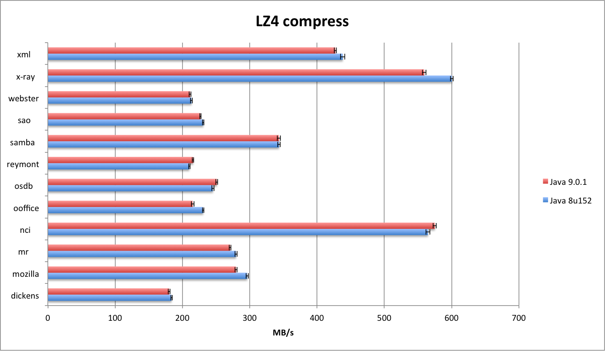
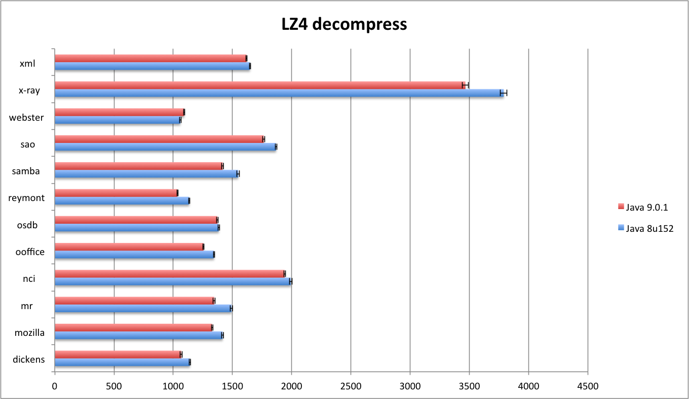

# Performance comparison between Java 8u152 and 9.0.1

Summary: Noticeable performance degradation in Java 9

## Testing parameters

* Benchmark: [CompressionBenchmark.java](src/test/java/io/airlift/compress/benchmark/CompressionBenchmark.java)
* Algorithm: lz4
* Data sets: silesia corpus
* JVMs
  * 1.8.0_152, VM 25.152-b16
  * 9.0.1, VM 9.0.1+11
* Platform:
  * Linux x86_64
  * Intel Xeon CPU E5-2660 @ 2.20GHz

To reproduce:

```
mvn test-compile exec:exec \
    -Dexec.classpathScope=test \
    -Dexec.executable="java" \
    -Dexec.args="-cp %classpath io.airlift.compress.benchmark.CompressionBenchmark -p algorithm=airlift_lz4 -i 20 -wi 20 -f 10"
```

Other available algorithms: airlift_lz4, airlift_lzo, airlift_snappy, airlift_zstd (decompressor only)

## Results

### Compression



#### Java 8
```
Data                Throughput
silesia/dickens     184.2MB/s ±  1404.8kB/s ( 0.74%) (N = 200, α = 99.9%)
silesia/mozilla     293.7MB/s ±  1475.0kB/s ( 0.49%) (N = 200, α = 99.9%)
silesia/mr          280.5MB/s ±  2094.4kB/s ( 0.73%) (N = 200, α = 99.9%)
silesia/nci         573.4MB/s ±  1843.5kB/s ( 0.31%) (N = 200, α = 99.9%)
silesia/ooffice     228.1MB/s ±  2282.9kB/s ( 0.98%) (N = 200, α = 99.9%)
silesia/osdb        246.4MB/s ±  1319.1kB/s ( 0.52%) (N = 200, α = 99.9%)
silesia/reymont     214.0MB/s ±   791.6kB/s ( 0.36%) (N = 200, α = 99.9%)
silesia/samba       340.3MB/s ±  1815.6kB/s ( 0.52%) (N = 200, α = 99.9%)
silesia/sao         231.7MB/s ±  1008.4kB/s ( 0.42%) (N = 200, α = 99.9%)
silesia/webster     211.9MB/s ±  1209.9kB/s ( 0.56%) (N = 200, α = 99.9%)
silesia/x-ray       595.7MB/s ±  3553.0kB/s ( 0.58%) (N = 200, α = 99.9%)
silesia/xml         444.8MB/s ±  2981.3kB/s ( 0.65%) (N = 200, α = 99.9%)
```

#### Java 9
```
Data                Throughput
silesia/dickens     182.3MB/s ±  1222.1kB/s ( 0.65%) (N = 200, α = 99.9%)
silesia/mozilla     282.1MB/s ±  1469.0kB/s ( 0.51%) (N = 200, α = 99.9%)
silesia/mr          272.4MB/s ±  1182.2kB/s ( 0.42%) (N = 200, α = 99.9%)
silesia/nci         575.3MB/s ±  2486.9kB/s ( 0.42%) (N = 200, α = 99.9%)
silesia/ooffice     211.2MB/s ±  1877.2kB/s ( 0.87%) (N = 200, α = 99.9%)
silesia/osdb        245.1MB/s ±  1949.4kB/s ( 0.78%) (N = 200, α = 99.9%)
silesia/reymont     215.0MB/s ±   931.4kB/s ( 0.42%) (N = 200, α = 99.9%)
silesia/samba       344.0MB/s ±  1678.5kB/s ( 0.48%) (N = 200, α = 99.9%)
silesia/sao         225.2MB/s ±   842.8kB/s ( 0.37%) (N = 200, α = 99.9%)
silesia/webster     209.9MB/s ±  1181.2kB/s ( 0.55%) (N = 200, α = 99.9%)
silesia/x-ray       561.7MB/s ±  1361.8kB/s ( 0.24%) (N = 200, α = 99.9%)
silesia/xml         423.5MB/s ±  1627.3kB/s ( 0.38%) (N = 200, α = 99.9%)
```

### Decompression



#### Java 8
```
Data                Throughput
silesia/dickens     1142.0MB/s ±  5103.1kB/s ( 0.44%) (N = 200, α = 99.9%)
silesia/mozilla     1409.2MB/s ±  8199.4kB/s ( 0.57%) (N = 200, α = 99.9%)
silesia/mr          1488.9MB/s ±  5264.7kB/s ( 0.35%) (N = 200, α = 99.9%)
silesia/nci         2005.1MB/s ±    12.1MB/s ( 0.60%) (N = 200, α = 99.9%)
silesia/ooffice     1332.4MB/s ±  7137.0kB/s ( 0.52%) (N = 200, α = 99.9%)
silesia/osdb        1380.5MB/s ±  6194.3kB/s ( 0.44%) (N = 200, α = 99.9%)
silesia/reymont     1131.0MB/s ±  5840.9kB/s ( 0.50%) (N = 200, α = 99.9%)
silesia/samba       1544.8MB/s ±  9613.3kB/s ( 0.61%) (N = 200, α = 99.9%)
silesia/sao         1867.3MB/s ±  7533.6kB/s ( 0.39%) (N = 200, α = 99.9%)
silesia/webster     1057.6MB/s ±  5698.4kB/s ( 0.53%) (N = 200, α = 99.9%)
silesia/x-ray       3861.1MB/s ±    33.9MB/s ( 0.88%) (N = 200, α = 99.9%)
silesia/xml         1632.7MB/s ±  8161.6kB/s ( 0.49%) (N = 200, α = 99.9%)
```

#### Java 9
```
Data                Throughput
silesia/dickens     1078.5MB/s ± 10032.3kB/s ( 0.91%) (N = 200, α = 99.9%)
silesia/mozilla     1315.1MB/s ±  7127.6kB/s ( 0.53%) (N = 200, α = 99.9%)
silesia/mr          1352.2MB/s ±    13.7MB/s ( 1.02%) (N = 200, α = 99.9%)
silesia/nci         1932.7MB/s ±  8892.5kB/s ( 0.45%) (N = 200, α = 99.9%)
silesia/ooffice     1271.5MB/s ±  5043.5kB/s ( 0.39%) (N = 200, α = 99.9%)
silesia/osdb        1390.5MB/s ±  5303.0kB/s ( 0.37%) (N = 200, α = 99.9%)
silesia/reymont     1048.1MB/s ±  3063.9kB/s ( 0.29%) (N = 200, α = 99.9%)
silesia/samba       1432.7MB/s ±  7309.2kB/s ( 0.50%) (N = 200, α = 99.9%)
silesia/sao         1752.9MB/s ±  7126.5kB/s ( 0.40%) (N = 200, α = 99.9%)
silesia/webster     1088.9MB/s ±  6557.3kB/s ( 0.59%) (N = 200, α = 99.9%)
silesia/x-ray       3458.3MB/s ±    24.1MB/s ( 0.70%) (N = 200, α = 99.9%)
silesia/xml         1607.9MB/s ±  7771.7kB/s ( 0.47%) (N = 200, α = 99.9%)
```

Full benchmark output:

* [Java 8](bench-8.txt)
* [Java 9](bench-9.txt)


# perfasm output

```
mvn exec:exec \
   -Dexec.classpathScope=test \
   -Dexec.executable="java" \
   -Dexec.args="-cp %classpath org.openjdk.jmh.Main io.airlift.compress.benchmark.CompressionBenchmark.decompress -p algorithm=airlift_lz4 -p name=silesia/mr -prof perfasm -f 1 -wi 10 -i 30"
```

* [Java 8](perf-8.txt)
* [Java 9](perf-9.txt)
